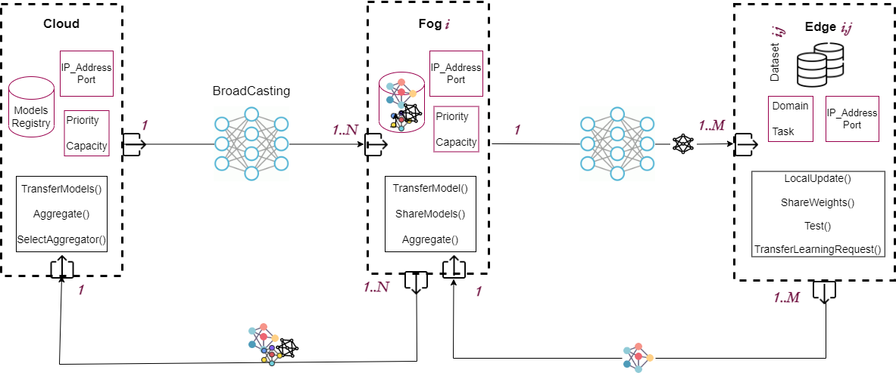

# FedGA-ICPS
FedGA-ICPS is a federated learning (FL) framework based on genetic algorithms for dynamic aggregation in Industrial Cyber-Physical Systems (ICPS). It is built in three layers (cloud, fog, and edge) as it’s shown in Figure bellow to deal with Non-IID data, aggregator availability, and learning insulation challenges. The cloud connects all the fog nodes, whereas each fog connects a selection edge nodes. FedGA-ICPS aggregates the NN models of ICPS entities. The models are personalized, trained with Non-IID data in the local, and shared to the dynamic, and powerful aggregator. Depending on the aggregator availability, priority, and capacity (e.g., computational resources), it is elected to dynamically aggregates heterogeneous models using genetic algorithms. The result is a stabilized global model, that will be broadcasted to all nodes (fog, edge, and cloud). When a new node is added to the ICPS network, it requests for a pretrained model to reduce the time of learning. FedGA-ICPS is developed based on PyTorch, and PyGAD library.

The neural networks' models are defined in entities/Models.py.   
The execution of Cloud.py, Fog.py, and Edge.py is lanched independtly using utils/CMD.txt file that contains commands as examples.
The save folder contains the results at the last FL round.

